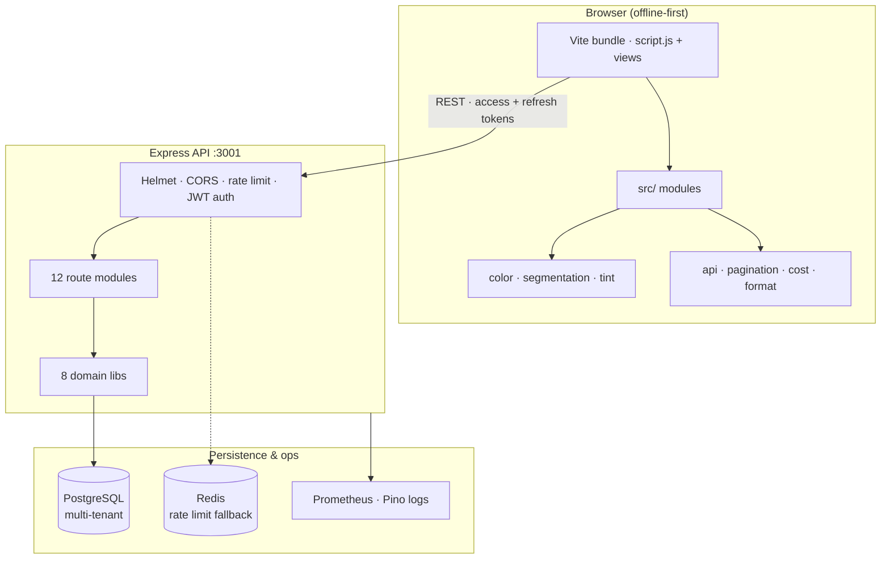

# Paint Intelligence Platform

A paint decision engine that helps customers choose a wall color confidently in under 60 seconds. Built for in-store dealer demos — upload a room photo, preview shades live on the walls, compare side by side, capture a lead, and sync everything to a real backend.

**Live demo:** [paintcrm.brohammad.tech](https://paintcrm.brohammad.tech) · **Login:** [/login](https://paintcrm.brohammad.tech/login)

| | |
|---|---|
| **Architecture** | [`ARCHITECTURE.md`](ARCHITECTURE.md) — full system reference |
| **Operations** | [`OPERATIONS.md`](OPERATIONS.md) — deploy, monitoring, runbooks |
| **Roadmap** | [`master-plan.txt`](master-plan.txt) — phase plan + metrics |

---

## Architecture at a glance



**Auth lifecycle (summary):** register/login → short-lived access token (~15m) + rotating refresh token (SHA-256 hash stored server-side) → transparent refresh on `401` → reuse detection revokes the session chain on token replay.

**Data integrity highlights:** server-computed quote/order totals · append-only credit ledger with row-level locking · auditable inventory movements · per-tenant document numbering.

---

## Tech stack

| Layer | Technologies |
|-------|----------------|
| **Frontend** | Vanilla JS, Vite, Vitest, Canvas 2D, optional DeepLab wall assist |
| **Backend** | Node.js, Express, `node-pg-migrate` |
| **Database** | PostgreSQL with tenant-scoped queries |
| **Auth** | JWT access + rotating refresh, bcrypt (12 rounds), session revocation |
| **Observability** | Prometheus metrics, Pino structured logs, health/ready/live probes |
| **Infra** | Docker multi-stage, GitHub Actions CI/CD, Fly.io + Render deploy |

---

## Test coverage

| Suite | Files | Tests | Runner |
|-------|-------|-------|--------|
| Backend API | 15 | 123 | Jest + Supertest |
| Frontend units | 9 | 80 | Vitest + jsdom |
| **Total** | **24** | **203** | CI on every push |

Key frontend modules under test: wall segmentation heuristics, HSL tint pipeline, paint cost estimator, API token refresh, pagination contract.

---

## Demo in 60 seconds

Use this flow for interviews, Loom recordings, or a live dealer walkthrough.

1. **Open** [paintcrm.brohammad.tech](https://paintcrm.brohammad.tech) (or local `http://localhost:3001`)
2. **Sign in** via Settings → Server Sync (or [/login](https://paintcrm.brohammad.tech/login))
3. **Upload** a room photo → smart wall mask + shade suggestions appear
4. **Pick a shade** → live recolor with before/after + compare slider
5. **Contact Dealer** → capture lead (syncs to backend when signed in)
6. **Quotes** → build a quote from the shade catalog with server-computed totals
7. **Ledger** → show customer balance + log a payment reminder

> **Loom tip:** Record at 1080p, ~2–3 min. Narrate *why* (dealer demo → lead → quote → receivables), not just *what* you click. End on the live URL so viewers can try it.

### Full walkthrough script (2–3 min)

| Step | Action | What to say |
|------|--------|-------------|
| 0 | Show hero + dealer branding | "Offline-first — works in a shop with bad Wi‑Fi; syncs when online." |
| 1 | Upload photo | "Under 60 seconds from photo to painted preview — heuristic mask + optional ML assist." |
| 2 | Tap wall / brush / multi-zone tabs | "Dealers can fix edge cases without leaving the demo." |
| 3 | Shade search + cost estimate | "Real Asian Paints / Dulux catalog — litres and ₹ estimate for a standard room." |
| 4 | Contact Dealer → Leads inbox | "Lead captured locally and on the server with snapshot + shade breakdown." |
| 5 | Customers → timeline | "CRM lite — customer auto-linked by phone, sites/projects, session history." |
| 6 | Quote → Convert to order | "Totals computed server-side — client can't tamper with line items." |
| 7 | Ledger → reminder | "Append-only credit ledger; order totals post automatically as debits." |

---

## What's in this repo

| Path | Description |
|------|-------------|
| `paint-preview-app/` | Main app — Vite-bundled HTML/CSS/JS; `src/` holds tested ES modules (color, segmentation, tint, api, …) |
| `server/` | Backend — Node.js + Express + PostgreSQL; 12 route modules, 8 domain libs, 10 migrations |
| `paint-preview-app/react-canvas-component/` | Reusable React/Next.js component extracting the same canvas logic |
| `test-scripts/` | Playwright E2E tests and backend smoke test scaffolding |
| `ARCHITECTURE.md` | Authoritative technical reference (algorithms, schema, data flows) |
| `master-plan.txt` | Phase roadmap from Decision Engine through CRM platform |

---

## Quick start

### Option A — With backend (Phase 4, recommended)

**Docker (easiest):**

```bash
cp server/.env.example server/.env
docker-compose up -d
# → http://localhost:3001
```

**Local Node + PostgreSQL:**

```bash
# Create a database, then set DATABASE_URL in server/.env (see server/.env.example)
cd server
npm install
npm run migrate:up
npm run start:with-migrate   # or: npm start (after migrations)
# → http://localhost:3001
```

The Express server serves the frontend **and** the API on a single port. Open [http://localhost:3001](http://localhost:3001) and use **Settings → Server Sync** to create an account.

### Option B — Standalone (no server)

```bash
cd paint-preview-app
npm install
npm run dev        # Vite dev server → http://localhost:5173
# or: npm run build && npx vite preview
```

Open the dev URL. Everything works offline via `localStorage` — no account needed. For a zero-install static serve of the built bundle: `npm run build` then serve `dist/`.

---

## Features

### Phase 1 — Decision Engine (done)

- **Room photo upload** — works from file or camera roll on mobile
- **Shade suggestions** — top 5 shades derived from the dominant room color
- **Live wall recolor** — natural HSL-based tint that preserves texture and lighting
- **Smart wall masking** — software region-growing with upper-wall bias, no manual setup needed
- **ML wall assist (beta)** — optional DeepLab segmentation fused with the heuristic mask
- **Tap to select wall** — click any point on the image to lock the wall region
- **Multi-wall tabs** — up to 5 independent wall zones, each with its own shade
- **Brush mask mode** — paint or erase the mask with a live cursor showing brush radius
- **Undo / redo** — full history stack (up to 20 steps) per wall tab
- **Edge feathering** — adjustable feather radius for clean mask boundaries
- **Before / after toggle** — instant flip to compare original and recolored
- **Compare drag slider** — drag a split-view handle to reveal any proportion of two shades side by side
- **Share / Export** — native share sheet on supported devices, PNG download fallback

### Phase 2 — Conversion Layer (done)

- **Real shade catalog** — 63 curated shades across Asian Paints, Dulux, Berger, and Nerolac loaded from `shades.json`
- **Shade search** — type any shade name, brand, or color family to instantly filter the catalog
- **Contact Dealer** — capture customer name, phone, email, notes, per-wall shade breakdown, and a live preview snapshot
- **Local Leads Inbox** — leads persisted in the browser; list, detail view, delete
- **Lead package export** — downloads snapshot PNG + structured `.json` sidecar (brand + shade per wall, dealer info)
- **Cost estimator** — estimates litres and INR cost for a standard room (40 sq m, 2 coats) on shade selection
- **Session draft save / restore** — workspace auto-saved; "Restore draft" lets users resume without re-uploading
- **Storage safety** — graceful fallback when localStorage is full

### Phase 3 — Pilot Validation (done)

- **Session analytics engine** — tracks `session_start`, `shade_selected` (with time-to-first-pick), `share_exported`, `contact_opened`, `contact_saved` in localStorage (up to 600 events)
- **Pilot Analytics dashboard** — second tab inside the Leads modal; KPI cards (sessions/30d, avg decision time, contact rate, share rate) and a 7-day bar chart
- **Dealer Settings** — Settings button opens a modal to set shop name, dealer name, and phone; shown as branded tagline in the hero
- **Dealer branding in exports** — dealer info embedded in every exported lead `.json`
- **Analytics export** — Settings → Download Analytics JSON for pilot review
- **Clear analytics** — reset event log before handing device to a new dealer

### Phase 4 — Backend Foundation (done)

A full Node.js + Express + PostgreSQL backend in `server/` with:

| Endpoint | What it does |
|----------|-------------|
| `POST /api/auth/register` | Create a dealer account — returns a short-lived access token + a refresh token |
| `POST /api/auth/login` | Authenticate — returns an access token (`~15m`) + a rotating refresh token |
| `POST /api/auth/refresh` | Exchange a refresh token for a fresh access token (rotates the refresh token) |
| `POST /api/auth/logout` | Revoke the current session's refresh token |
| `POST /api/auth/logout-all` | Revoke every active session for the tenant |
| `GET /api/auth/me` | Validate token, return tenant profile |
| `GET /api/leads` | List all leads for the signed-in dealer |
| `POST /api/leads` | Create / upsert a lead (id, name, phone, shades, snapshot) |
| `GET /api/leads/:id` | Single lead with full snapshot |
| `DELETE /api/leads/:id` | Delete a lead |
| `GET /api/shades` | Full catalog — searchable via `?q=` |
| `GET /api/shades/:id` | Single shade |
| `GET /api/dealer` | Get dealer profile |
| `PUT /api/dealer` | Update shop name, dealer name, phone |
| `POST /api/events` | Ingest a funnel analytics event |
| `GET /api/events/summary` | 30-day funnel metrics (sessions, contact rate, share rate, avg decision time, 7-day daily breakdown) |

**Frontend sync (graceful degradation):**
- All leads sync to the server automatically when signed in; deletes propagate too
- Cross-device lead restore fetches preview snapshots via `GET /api/leads/:id`
- Dealer profile pulled from server on sign-in
- Pilot Analytics dashboard uses server funnel metrics when signed in
- Shade catalog loads from `/api/shades` when signed in (falls back to `shades.json` offline)
- Every analytics event is sent to `/api/events` in addition to being stored locally
- Dealer settings saved via `PUT /api/dealer` on form submit
- On startup, a stored token is validated and leads are merged from the server
- App stays fully functional offline — server sync is always best-effort

**Server Sync in Settings modal:**
- Sign In / Create Account tabs
- Live connection status chip (green "Connected" / grey "Not connected")
- Logout

### Phase 5 — CRM Lite (done)

When signed in to the backend:

| Endpoint | What it does |
|----------|-------------|
| `GET/POST/PUT/DELETE /api/customers` | Customer CRUD (search via `?q=`) |
| `GET /api/customers/:id/timeline` | Merged leads + preview sessions for a customer |
| `GET/POST/PUT/DELETE /api/sites` | Site/project per customer (`?customerId=`) |
| `POST /api/sessions` | Record preview session events on the timeline |

- **Customers** button in the app — browse, search, add, **edit, and delete** customers
- **Sites/projects** — add via a form on the customer detail view
- **Lead capture** auto-creates or links customers by phone; optional customer + site link
- **Timeline** on each customer — session starts, shade picks, lead captures
- **Lead → customer** — jump from a lead to its linked customer profile
- **Offline cache** — last-synced customers stay viewable offline; writes require sign-in

### Phase 6 — Commercial Modules (in progress)

Quote → order flow for signed-in dealers.

| Endpoint | What it does |
|----------|-------------|
| `GET/POST /api/quotes` | List (filter by `?customerId=` / `?status=`) and create quotes with line items |
| `GET/PUT/DELETE /api/quotes/:id` | Read, replace (header + items), and delete a quote |
| `PATCH /api/quotes/:id/status` | Move a quote through draft → sent → accepted / rejected |
| `POST /api/quotes/:id/convert` | Create an order from the quote and lock the quote as `converted` |
| `GET/POST /api/orders` | List and create orders (direct or via conversion) |
| `GET/DELETE /api/orders/:id` | Read and delete an order |
| `PATCH /api/orders/:id/status` | Move an order through pending → confirmed → fulfilled / cancelled |

- **Quotes** button in the app — a Quotes / Orders tabbed modal with a status filter
- **Quote builder** — pick a customer + site, add line items manually or from the shade catalog (auto-fills price/L and standard-room litres), set discount and tax rate, live totals
- **Server-computed totals** — subtotal, discount, tax, and total are always recomputed on the server (line totals are never trusted from the client)
- **Per-tenant document numbers** — sequential `Q-0001` / `O-0001`, isolated per dealer
- **Convert to order** — one click turns an accepted quote into an order (items + totals snapshotted); the quote is then read-only
- **Status workflows** — inline status controls on the quote/order detail view
- Requires sign-in (commercial data is server-only; the offline decision flow is unaffected)

Inventory basics + stock status:

| Endpoint | What it does |
|----------|-------------|
| `GET/POST /api/inventory` | List (search `?q=`, filter `?status=`) and create stock items |
| `GET/PUT/DELETE /api/inventory/:id` | Read (with movement history), update metadata, delete |
| `POST /api/inventory/:id/adjust` | Apply a signed stock movement (`{delta, reason}`) |
| `GET /api/inventory/summary` | Counts by stock status + total stock value |

- **Inventory** button — item list with search, stock-status filter, and summary chips (items / low / out / stock value)
- **Stock status** derived from quantity vs. reorder level: `in_stock` / `low_stock` / `out_of_stock`
- **Auditable movements** — every quantity change (opening stock, receive, issue, correction) is recorded with a running balance; adjustments can't drive stock negative
- **Catalog link** — optionally link an item to a shade to auto-fill name/brand/price
- **Per-tenant SKUs** — optional, uniquely enforced only when provided

Credit ledger + payment reminders:

| Endpoint | What it does |
|----------|-------------|
| `GET /api/ledger/summary` | Tenant-wide receivables snapshot (receivable, overdue amount, debtor counts) |
| `GET /api/ledger/customers` | Customers with an outstanding balance (`?overdue=true`, `?q=` search) |
| `GET /api/ledger/customers/:id` | Full statement — balance, overdue state, entries + reminders |
| `POST /api/ledger/customers/:id/entries` | Record a debit (charge) or credit (payment) |
| `POST /api/ledger/customers/:id/reminders` | Log a payment reminder action (with balance snapshot) |

- **Ledger** button — receivables summary chips, an "everyone who owes / overdue only" filter, and a searchable debtor worklist
- **Append-only account** — every debit/credit stores the running balance after it was applied, so a statement renders without re-summing
- **Order totals post automatically** — creating (or converting to) an order writes a debit to the customer's account; deleting the order writes a compensating reversal so balances stay correct
- **Overdue flags** — a customer is overdue when they owe money and a dated charge is past due; overdue accounts sort to the top of the worklist
- **Reminder actions** — log a WhatsApp / call / SMS / email follow-up; each is timestamped with the balance at the time
- Requires sign-in (commercial data is server-only)

### Platform & scale hardening (done)

Cross-cutting improvements that make the platform production-ready at scale:

- **Paginated list APIs** — every list endpoint (`customers`, `leads`, `quotes`, `orders`, `inventory`, `ledger/customers`) accepts `?limit=` & `?offset=` and returns a `pagination` block `{ total, limit, offset, hasMore }`. Defaults to 50/page, capped at 200. The debtor worklist has a **"Load more"** pager wired to it.
- **Hardened auth lifecycle** — short-lived access tokens (`~15m`) backed by long-lived, **rotating** refresh tokens persisted server-side (only the SHA-256 hash is stored). Refresh rotation includes **reuse detection** (replaying a rotated token revokes the whole session chain), plus `logout` (single session) and `logout-all` (every session). The frontend refreshes access tokens **transparently on `401`**. Password policy: min 8 chars with at least one letter and one number.
- **Modular, bundled frontend** — built with **Vite** (minified + hashed assets, source maps). Pure logic lives in tested ES modules under `paint-preview-app/src/`:

  | Module | Responsibility |
  |--------|----------------|
  | `color.js` | Hex/RGB/HSL conversion, pixel colour reads |
  | `segmentation.js` | Wall detection, mask grow/fuse/smooth, ML mask extraction |
  | `tint.js` | Alpha masks, feathering, HSL recolor blend, shade suggestions |
  | `cost.js` | Paint litres + INR estimate for a standard room |
  | `api.js` | Token storage, `apiRequest`, transparent refresh on `401` |
  | `pagination.js` | Client-side paging matching the backend contract |
  | `format.js` / `ids.js` | CRM HTML helpers, offline id generation |

  **80 Vitest tests** cover the engine modules; `script.js` (~3,800 lines) remains the DOM/event wiring layer (view split planned). The server serves built `dist/` in production (falls back to raw source for zero-build local dev).

---

## Local development checklist

See **[Demo in 60 seconds](#demo-in-60-seconds)** for the interview/Loom flow. For local setup:

1. Start the server: `cd server && npm run start:with-migrate`
2. Open [http://localhost:3001](http://localhost:3001)
3. **Settings → Server Sync → Create Account**
4. **Settings → Dealer Profile** — shop name, dealer name, phone
5. Upload photo → shades → Contact Dealer → Customers → Quote → Ledger

---

## Running tests

### E2E (Playwright)

```bash
pip install -r test-scripts/requirements.txt
python3 -m playwright install chromium

# Start a server first, then:
python3 test-scripts/frontend_e2e_playwright.py --app-url http://localhost:3001
```

### API smoke test

```bash
cd server && npm start &   # start server

# Register + full round-trip
curl -s -X POST http://localhost:3001/api/auth/register \
  -H 'Content-Type: application/json' \
  -d '{"shopName":"My Shop","email":"me@shop.com","password":"demo1234"}'
```

### Frontend unit tests (Vitest)

```bash
cd paint-preview-app
npm install
npm test          # run the jsdom unit tests
npm run build     # produce the minified bundle in dist/
```

---

## Deployment

Production runs on **Render** (free tier) with custom domain **paintcrm.brohammad.tech**. Fly.io config is also included.

### Render (current production)

Connect the repo via [`render.yaml`](render.yaml) — Docker build, Neon Postgres, auto-deploy on push.

### Fly.io (alternative)

```bash
# One-time
fly apps create paintcrm
fly postgres create --name paintcrm-db && fly postgres attach paintcrm-db
fly secrets set JWT_SECRET="$(openssl rand -hex 32)" DB_SSL=false

# Deploy
fly deploy            # or push to main — CI deploys via the Fly GitHub Action
```

CI/CD (`.github/workflows/ci.yml`) runs backend lint/tests, frontend tests + build, a Docker build, and a Trivy scan, then deploys to Fly.io staging → production on `main` (gated on the `FLY_API_TOKEN` secret; the deploy steps no-op cleanly when it isn't set).

---

## React component

`paint-preview-app/react-canvas-component/` contains a self-contained `WallRecolorCanvas.tsx` component and `pixelUtils.ts` you can copy into any React/Next.js project. See the [component README](paint-preview-app/react-canvas-component/README.md) for integration steps.

---

## Roadmap

| Phase | Status | Description |
|-------|--------|-------------|
| 0 | Done | Product contract — scope, flow, success metrics |
| 1 | Done | Decision Engine — masking, recolor, compare, share |
| 2 | Done | Conversion layer — shade catalog, search, lead capture, inbox, cost estimator, session drafts |
| 3 | Done | Pilot validation — analytics engine, dealer branding, KPI dashboard |
| 4 | Done | Backend foundation — auth, lead/shade/dealer APIs, funnel event tracking, Docker, CI |
| 5 | Done | CRM Lite — customer CRUD, sites/projects, session timeline (server sync) |
| 6 | Done | Commercial modules — quote → order, inventory/stock, credit ledger + payment reminders (log-only; outbound send planned) |
| — | Done | Scale hardening — paginated APIs, refresh-token auth, Vite frontend modules + 80 unit tests, Docker CI/CD |
| 7 | Next | AI palette recommendations, dealer assistant, WhatsApp reminder delivery |

See [`master-plan.txt`](master-plan.txt) for the full execution plan with sprint breakdowns and success metrics.
